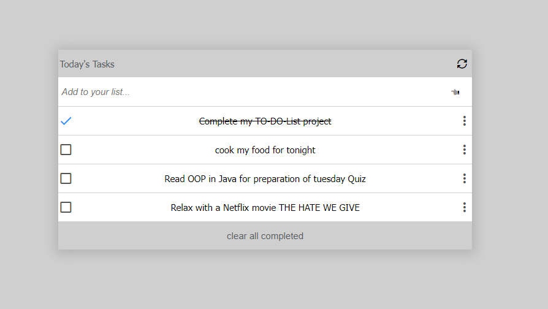

# TO-DO List

> "To-do list" is a tool that helps to organize your day. It simply lists the things that you need to do and allows you to mark them as complete.

## Built With

- Major languages: JAVASCRIPT | HTML | CSS 
- Frameworks: Bootstrap
- Technologies used : Git | Github | Linter | Webpack

## Live Demo

[the project will be deployed once complete](https://livedemo.com)

## Getting Started

To get a local copy up and running follow these simple example steps.

1. First clone the project with the command git clone https://github.com/RolandM99/To-Do-List.git
2. Then run the command npm install in your terminal to open the project in your browser
3. [optional] You can even fork the project

👤 **Authour:** **Roland Manful Mweze**

- GitHub: [Rolandm99](https://github.com/RolandM99)
- Twitter: [@Manfulmwez](https://twitter.com/ManfulMwez)
- LinkedIn: [Roland N. MWEZE](https://www.linkedin.com/in/roland-n-mweze-8b1045189/)

## 🤝 Contributing

Contributions, issues, and feature requests are welcome!

Feel free to check the [issues page](../../issues/).

## Show your support

Give a ⭐️ if you like this project!

## 📝 License

This project is [MIT](./MIT.md) licensed.

